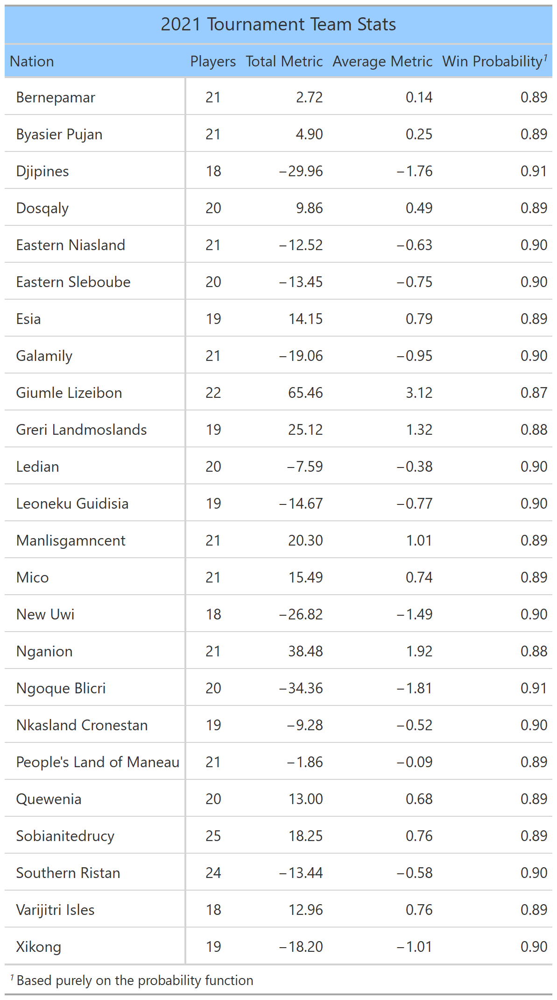
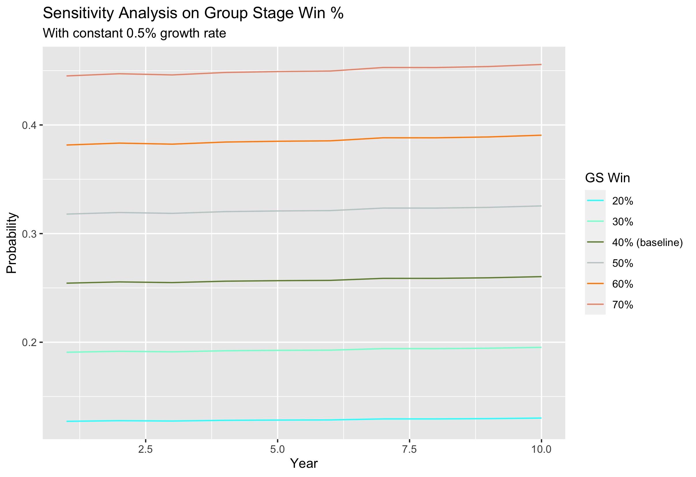
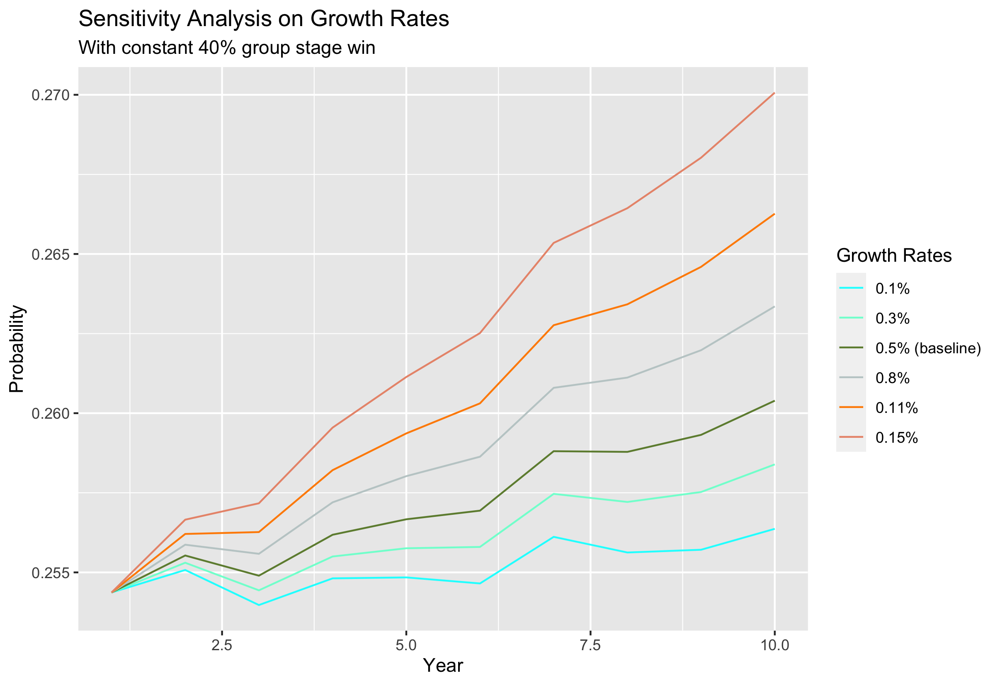

Case Summary

The Commissioner of Sport for Rarita, Hammessi Bayes, has expressed interest in constructing a competitive national team for Rarita's football program. 
Countries with successful sports teams often benefit economically through award money, country visibility, increased tourism, etc. The Commissioner is aiming for 
a high probability of winning a FSA championship in the next 10 years, and a team competitive competitive enough to place top 10 within the 
next 5 years. In order to achieve this goal, we have developed a 10 year implementation plan that specifies team selection methods and maintenance, 
economic models for revenue and expense forecasting, as well as detailed risk considerations. 

---

Prob of winning

Given that our team metric is correlated with team performance, we use the difference between team metrics to derive the probability of a certain team winning.
The intuitive idea behind the method is that greater differences suggest higher probabilities of winning. The probability of winning against each team can be 
seen in the table below:

We also make a set of (baseline) assumptions on the tournament structure and growth environment: 

* The tournament involves group stages of eight groups, where two teams from each group emerge. The remaining 16 teams play normal tournament bracket 
style matches (up to four more games). 

* The probability our team exits group stages in any given year is a static 40% (this is a conservative assumption to reflect the weak relation between 
win rate and team metric). This can be adjusted for sensitivity analysis. 

* We reinvest all excess cash flows back into the team, and so we very conservatively assume a 0.5% growth rate over our competitors. This growth will be 
reflected by an annual increase in our team metric. This can also be adjusted for sensitivity analysis. 

* We face four random opponents after group stages. 

Using the win rates against each team, and the set of assumptions, the probability of winning the tournament at least once in the next 10 years can be calculated. 
This is visualised in the graphs below with varying set of assumptions (grey line is the baseline). 

Under the baseline assumptions, the team has a **95% chance of winning a final in the next ten years**. The chances of placing top 5 in the next 5 years is
approximately 83%. This in turns suggests a sufficiently high chance to place top 10 in the next 5 years. 

