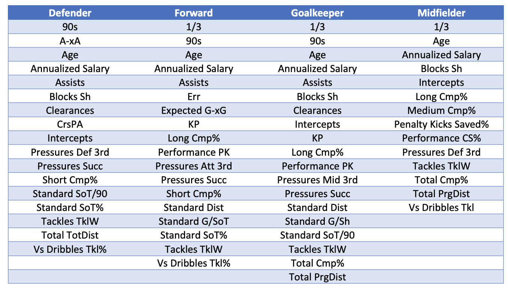
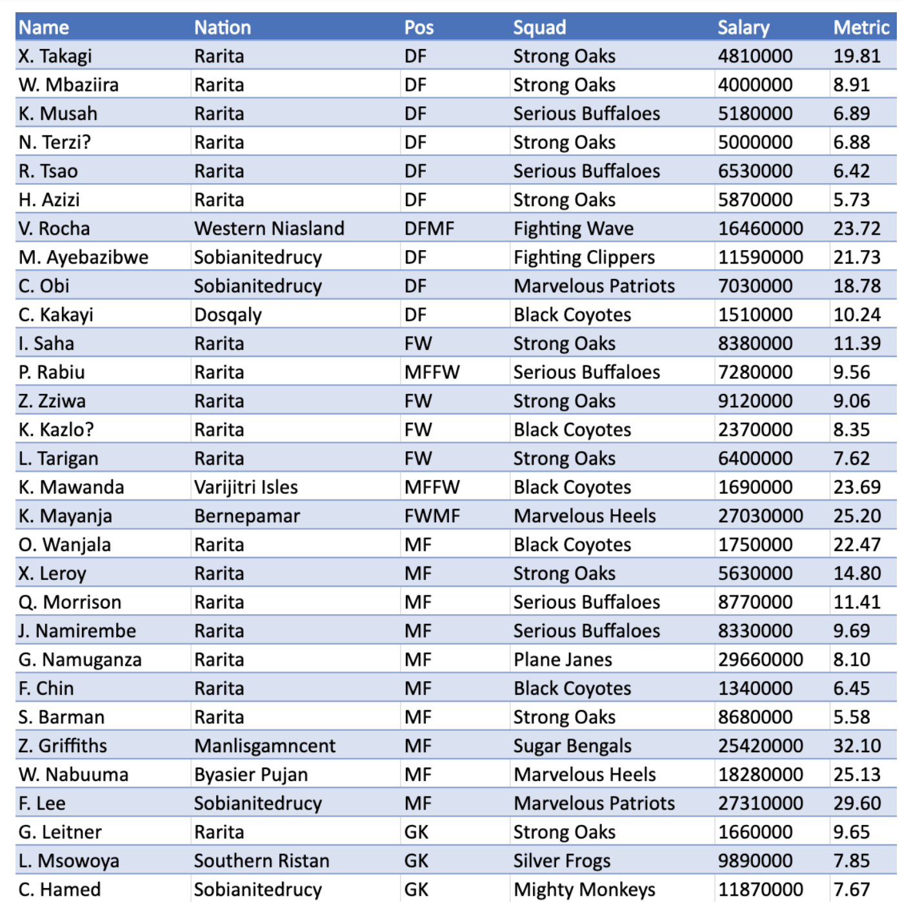

# Team Selection

The Raritan football team was constructed by performing unsupervised regression analysis on historical player data to determine the statistics that contributed the most to each player’s competitiveness. 

The regressor variables that indicated a player’s relative strength were their **league standing, tournament rank and minutes played divided by ninety (90s).**

The most significant predictors for each player position were identified via sequential replacement subset selection and the relative influence output of the boosting method.

Afterwards, a metric to evaluate each player’s proficiency was formed from the sum of the standardised significant variables. The final team selected using our team selection method is found below with an average team metric of 14.51 and consisting of 30 players.

#### Reasoning for metric:
* By using a maximum of 19 predictors, this greatly reduced the number of variables for each player.
* Only the most relevant predictors were chosen to allow for a better picture of each player’s skill and expertise.
* The final metric was comparable and allowed for an accurate depiction of a specific player's skill.

To measure the success of the metric, the following plot demonstrates the relationship between the average metric and the ranking of the teams in the 2021 tournament. 

There is an approximate relationship indicated by the graph; the higher the rank, the higher the average metric (hence performance of the team) which is in line with our assumptions. To account for any modelling/inference errors and deviations from the actual, more conservative measures were put into place in the prediction of win probabilities. 

